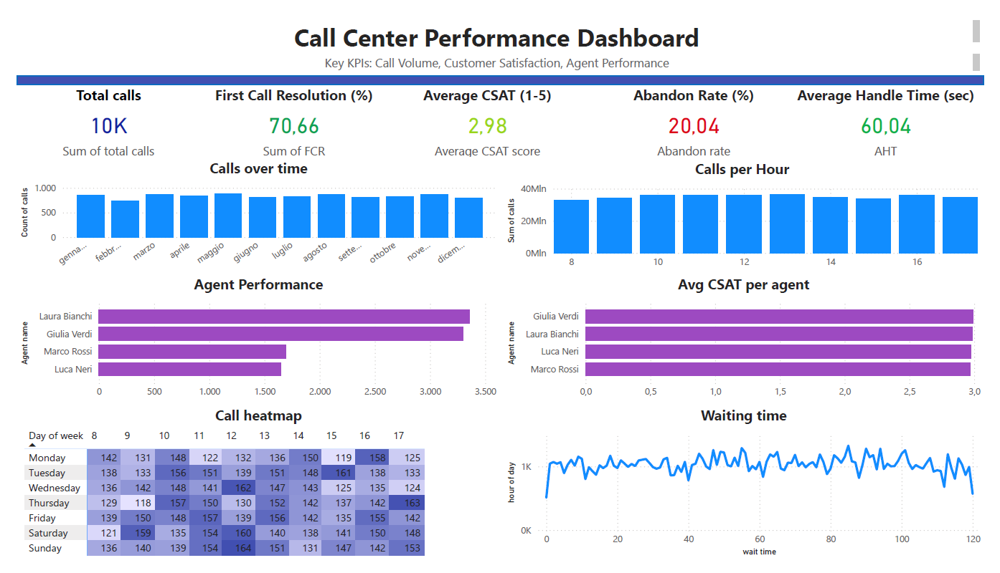

# Call Center Optimization: reducing abandon rate and improving customer satisfaction

## Business Problem
The call center is experiencing performance inefficiencies highlighted by a high abandon rate (20.04%) and low customer satisfaction (CSAT 2.98/5).  
These metrics indicate issues in call handling, long waiting times, and suboptimal customer experience, potentially leading to customer loss.

## Key Insights
- High Abandon Rate (20.04%)
- Waiting Time Variability
- Uneven Agent Workload (some agents handle significantly more calls)
- Low CSAT (2.98), suggests issues in resolution effectiveness or customer experience
- FCR at 70.66%

## Recommendations

### Workforce Optimization
- Align staffing with hourly call patterns
- Increase coverage during peak hours
- Introduce flexible shifts

### Reduce Waiting Time
- Implement callback system
- Improve queue management
- Optimize IVR to reduce unnecessary transfers

### Improve First Call Resolution (FCR)
- Targeted agent training
- Better access to knowledge base
- Standardized handling procedures

### Smart Call Routing
- Route complex calls to high-performing agents
- Balance workload across agents

### Optimize AHT (Average Handle Time)
- Streamline processes
- Reduce inefficiencies without impacting quality

## Expected Impact

- Abandon Rate: 20.04% → < 10%
- CSAT: 2.98 → > 3.8
- FCR: 70.66% → > 80%
- Waiting Time: reduction and stabilization
- AHT: 60 sec → ~50 sec

## Conclusion
The main issue is not only staffing levels, but how resources are allocated and managed.  
Improving workforce planning, reducing waiting times, and enhancing agent performance can significantly increase customer satisfaction while reducing call abandonment.
