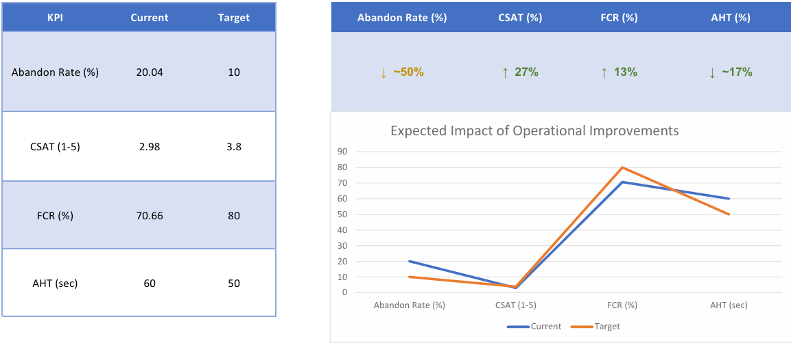

## Call Center Optimization: reducing abandon rate and improving customer satisfaction
This project analyzes call center performance to identify operational inefficiencies and improve customer experience.

## Business Problem
This call center is experiencing performance inefficiencies highlighted by a high abandon rate (20.04%) and low customer satisfaction (CSAT 2.98/5).  
These metrics indicate issues in call handling, long waiting times, and suboptimal customer experience, potentially leading to customer loss.

## Observations
The data highlights a clear imbalance between demand and service capacity.
- **Abandon rate above 20%**
  A significant share of customers drops before being served, suggesting excessive waiting times.
- **Inconsistent waiting time**
  Variability across time slots indicates that staffing is not aligned with call volume patterns.
- **Agent workload imbalance**
  Some agents handle a disproportionate number of calls, pointing to inefficient distribution.
- **Low customer satisfaction (CSAT 2.98)**
  Indicates that even completed calls are not delivering a strong customer experience.
- **FCR at ~70%**
  A relevant portion of issues is not resolved on first contact, increasing repeat calls and congestion.

## What Can Be Improved

**Current staffing does not reflect actual demand patterns.**
- Align shifts with peak hours
- Introduce more flexible coverage during high-load periods

**The call routing experience can be streamlined.**
- Simplify IVR structure

**Improving FCR would directly reduce call volume pressure.**
- Strengthen agent training
- Standardize handling of frequent issues

**Long and unpredictable waiting times are a key driver of abandonment.**
- Introduce callback options
- Improve queue prioritization

**Service quality appears uneven.**
- Monitor individual KPIs (FCR, AHT, CSAT)
- Provide targeted coaching where needed

## Expected Impact
If addressed, these improvements could realistically lead to:
- Abandon Rate: 20.04% → < 10%
- CSAT: 2.98 → > 3.8
- FCR: 70.66% → > 80%
- Waiting Time: reduction and stabilization
- AHT: 60 sec → ~50 sec

## Final note
The main issue is not only staffing levels, but how resources are allocated and managed.  
Improving workforce planning, reducing waiting times, and enhancing agent performance can significantly increase customer satisfaction while reducing call abandonment.
